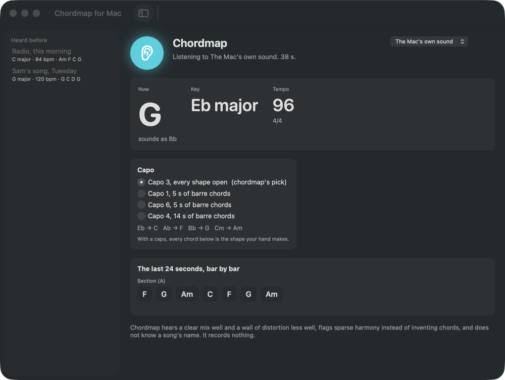
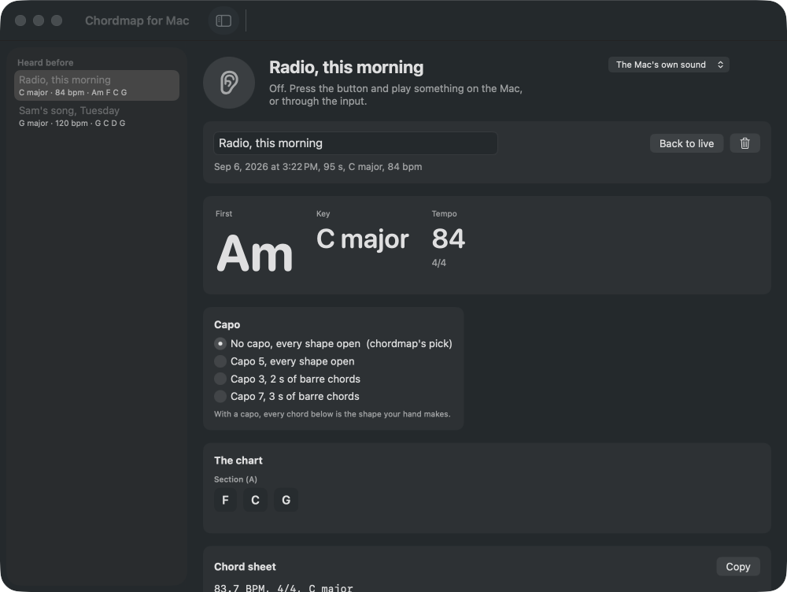

# chordmap

**Use it: [keithadler.github.io/chordmap](https://keithadler.github.io/chordmap/)**. Drop a song, get the chart. Nothing is uploaded.

Tempo, key, chords, sections, a capo suggestion and stems from any audio
file. Pure Rust, compiles to WebAssembly, MIT licensed. The audio never
leaves your browser: there is no server, no account, no analytics. The AI
stem separation is local as well: the model downloads into the browser and
runs on your device.

- **Web app**: drop an MP3, M4A, WAV, FLAC or OGG and get the BPM with half and double buttons and tap tempo, 4/4 or 3/4, the key with its runner-up, a chord chart per bar grouped by section, a clickable section map that follows playback, a now-playing footer with the last three, current and next three chords, and the capo fret that turns the most chords into open shapes, with fingering diagrams. Loop any section at 50 to 100 percent speed without changing pitch. Read the chart as shapes, sounding chords or Nashville numbers. Fix any chord or section name in place and nudge the bar lines; corrections are kept in your browser, come back when the same file is dropped again, and go into every export. Copy, print, or download the chord sheet as text, ChordPro or MIDI, and share the chart as a link that carries no audio. Drop several files to chart a whole set. Guitar or ukulele diagrams. A live visualizer panel runs while the song plays, and the same three styles go full screen: Stage for the players (huge current chord, next chord with a beat countdown, beat dots, section progress), Flow for what is coming (chords sliding toward a now line), and Aurora for the room (audio-reactive pitch bloom and spectrum ring, beat rings, section colour). Play along with a practice mix: instrumental or vocals in seconds by centre cancel, or real AI stems (vocals, drums, bass, other) separated by a model that runs locally in the browser, the MIT KUIELab MDX-Net models, with the audio never leaving the device, mixed with faders, pitch-shifted up to six semitones either way at the same tempo, and the chart can be redone from the stems for cleaner chords. A genre switch (band, hip hop, dance) moves the tempo prior and names the hook or the drop, and sparse-harmony beats are flagged instead of getting a fake chord chart. Lyrics too: Whisper transcribes the separated vocals on your device, the words land under the chords in every bar, follow along in the footer while it plays, go into the text and ChordPro exports with the chords placed in the line, and every bar's words can be corrected by hand. Installs as an app on desktop and phones. Works offline after the first visit.
- **Rust crate** `chordmap`: the engine, no I/O, no `unsafe`, no models to download.
- **npm package** `chordmap`: WebAssembly bindings with TypeScript types.
- **CLI** `chordmap`: one binary for scripts and shells.

```bash
chordmap analyze song.mp3            # chord sheet, sections, capo
chordmap analyze song.mp3 --json     # everything, for other tools
chordmap analyze song.mp3 --bpm 84   # prefer the tempo nearest a hint
chordmap synth test.wav --chords "C G Am F" --bpm 100 --loops 8
```

```ts
import init, { analyze } from "chordmap";
await init();
const a = JSON.parse(analyze(monoFloat32Samples, sampleRate, "{}"));
a.tempo.bpm;            // 89.5
a.key.name;             // "Bb major"
a.guitar.capo;          // 3
a.guitar.shapes;        // { "Bb": "G", "F": "D", "Gm": "Em", "Eb": "C" }
a.bars[4].beats;        // ["Bb", "Bb", "F", "F"]
a.sections[1].guess;    // "chorus"
```

```rust
let a = chordmap::analyze(&samples, sample_rate, &chordmap::Options::default())?;
println!("{}", chordmap::chord_sheet(&a));
```

## Chordmap for Mac

The same engine as a Mac app that hears what the Mac is playing, in any app, and charts it live: the chord now, the key, the tempo, the bars by section, the capo, and a history of every listen with its chord sheet.



**[Download Chordmap-for-Mac-1.0.0.dmg](https://github.com/keithadler/chordmap/releases/download/mac-v1.0.0/Chordmap-for-Mac-1.0.0.dmg)** (macOS 14 or later, Apple Silicon). Open the DMG, drag the app to Applications, open it; the first time, right-click the app, choose Open, then Open again. It asks once for System Audio Recording, which is how macOS describes hearing what the Mac plays, and records nothing. Details, limits and the command line in [mac/README.md](mac/README.md).



## How it works

Every step is classic music information retrieval, the same family of
methods librosa and Essentia implement, written from scratch in Rust so it
runs anywhere WebAssembly runs.

1. Audio is resampled to 22.05 kHz and analysed with a 4096-point STFT every 23 ms.
2. **Tempo**: spectral flux on 40 mel bands gives an onset curve; its autocorrelation, weighted by a prior around 120 BPM, ranks tempo candidates. A hint from tap tempo or the half and double buttons picks the octave.
3. **Beats**: dynamic programming over the onset curve (Ellis 2007).
4. **Tuning**: spectral peaks vote on how far the recording sits from A440; the semitone grid is shifted to match, so a tape-speed or baroque-pitch recording still lands on the right pitch classes.
5. **Chords**: spectral peaks feed a 60-semitone pitch grid (peaks, not bins, because below middle C the window is wider than a semitone). It is median-filtered in time to drop drum hits, turned into pitch salience where each note is supported by its own harmonics, folded to 12 pitch classes over C2 to B5, averaged per beat, matched against 60 templates (major, minor, dominant seventh, major seventh, minor seventh), and smoothed with Viterbi decoding so chords do not flicker. A seventh must beat the plain triad by a margin.
6. **Key**: Krumhansl-Kessler profile correlation on the whole song's chroma.
7. **Meter and downbeats**: for 4 and for 3 beats per bar, the beat phase where chord changes and low-end energy line up; the meter whose best phase stands out most wins, with 4/4 favoured.
8. **Sections**: chroma plus timbre per bar, a self-similarity matrix, checkerboard novelty for boundaries, then repeated segments are grouped by diagonal similarity. Names like "verse" and "chorus" are guesses from repetition and loudness.
9. **Stems**: quick mode subtracts the centre channel per STFT bin with the low end protected (Rust, seconds). AI mode runs the KUIELab MDX-Net models (MIT, 2021 Music Demixing Challenge) through onnxruntime-web, WebGPU when the browser has it, on 6-second chunks whose spectrograms are built and inverted by the Rust engine. Models and runtime are fetched only when asked, from the project's own GitHub Pages, and cached.
10. **Lyrics**: Whisper base.en (OpenAI, Apache-2.0, in the Xenova ONNX export) through transformers.js, on the vocal stem when there is one, with word timestamps. Words are attached to bars by their start time. The model is served from the project's own GitHub Pages like the stem models, on request, cached after.
11. **Pitch shift**: phase-vocoder time stretch then resampling, so the key changes and the tempo does not.
11. **Capo**: every fret from 0 to 7 is scored by how many seconds of the song land on barre chords; the fret that removes the most wins, and a capo has a small cost of its own so it only wins when it removes real barre time.

A four-minute song takes about two seconds natively and five in the browser.

## Limits

- Chords are major, minor, dominant seventh, major seventh and minor seventh. Suspended, diminished, augmented and slash chords come back as the nearest of those.
- Chord accuracy on a full mix is roughly three in four on pop, rock and folk. Dense arrangements, heavy distortion and solo voice do worse. Charting again from the separated stems helps.
- Hip hop and electronic tracks often have little harmony; the app says so and the chords are implied at best. Tempo, key, sections and stems are the useful parts there.
- Quick centre-cancel leaves panned backing vocals and reverb and thins a centred snare. AI stems are far better but take a download and a minute or more.
- The beat grid assumes a steady tempo. 4/4 and 3/4 are told apart; 6/8, 5/4 and 7/8 are not, and `--beats-per-bar` overrides the guess.
- Half or double tempo happens. The alternatives are always listed; tap tempo settles it.
- Section boundaries land within a bar or so; the verse and chorus labels are heuristics, not detection.
- The first beat of a song is often missed, so the chart may begin with a short pickup bar.

More in [docs/limitations.md](docs/limitations.md).

## How it is tested

No copyrighted audio is used. `chordmap::synth` renders deterministic click
tracks and strummed chord progressions with a bass note and drum clicks. The
test suite checks tempo within 2 percent (or an octave) at 90, 128 and 174
BPM, that a tempo hint picks the octave, that an eight-loop C G Am F
progression comes back as C major with at least 90 percent of beats labelled
correctly, that a Cmaj7 Am7 Dm7 G7 progression is heard as sevenths while the
plain-triad progression gets none, that a waltz is reported as 3/4, that a
recording detuned by 35 cents is corrected and still charted, that an A B A
arrangement with different timbres returns three sections labelled A B A
with boundaries within six beats, and that the capo picker sends a Bb song
to fret 3 and leaves a C song alone.

```bash
cargo test --release --workspace
./scripts/build-wasm.sh && python3 -m http.server --directory examples/web
```

## Layout

- `crates/chordmap`: the engine (`dsp`, `features`, `tempo`, `chroma`, `chords`, `key`, `sections`, `guitar`, `synth`, `analysis`).
- `crates/chordmap-wasm`: wasm-bindgen wrapper; `scripts/build-wasm.sh` writes `pkg/`.
- `crates/chordmap-cli`: `chordmap analyze` and `chordmap synth`, decoding through symphonia.
- `examples/web`: the static web app deployed to GitHub Pages.

## License

MIT. See [LICENSE](LICENSE).
